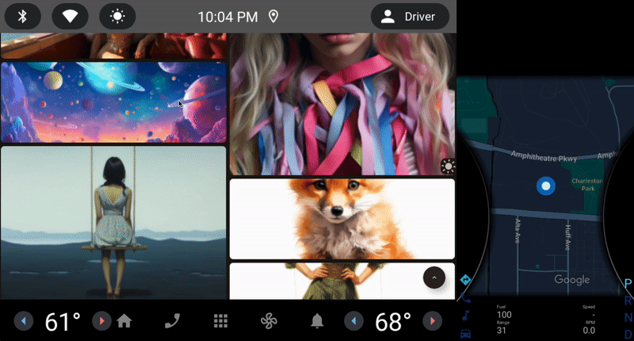

# MidJourney Images Compose Multiplatform Mobile Application

[](https://androidweekly.net/issues/issue-567)
<a href="https://mailchi.mp/kotlinweekly/kotlin-weekly-352"></a>
[](https://github.com/mbakgun/midjourney-images-compose-multiplatform/actions/workflows/main.yml)
#### Vorgestellt auf [Google Dev Bibliothek](https://devlibrary.withgoogle.com/products/android/repos/mbakgun-midjourney-images-compose-multiplatform)

Diese Anwendung wurde entwickelt, um die Bilder von MidJourney anzuzeigen. Die Anwendung wurde mit Compose Multiplatform entwickelt. Die Anwendung läuft auf den Plattformen Android, iOS, Web, Wear OS, Android Automotive, Android TV

<p align="center"><br><br></p>
Die Anwendung wurde im MVVM-Konzept mit Kotlin und Jetpack Compose entwickelt. Es wurden Netzwerkanforderungszustände, Endlos-Pagination, Bildladeprozesse und Bildcaching durchgeführt.

## Verwendete Bibliotheken

- [Compose Multiplatform](https://www.jetbrains.com/lp/compose-multiplatform/)
- [Ktor](https://ktor.io/)
- [Koin](https://insert-koin.io/)
- [Kotlinx Serialization](https://kotlinlang.org/docs/serialization.html)
- [Kotlinx Coroutines](https://kotlinlang.org/docs/coroutines-overview.html)
- [Coil](https://coil-kt.github.io/coil/)
- [Multiplatform Settings](https://github.com/russhwolf/multiplatform-settings)

<div style="text-align: center;"></div>

Verbraucheranwendungen haben keine komplexen Strukturen oder Operationen. Sie verwenden die gemeinsame UI-Schicht (einschließlich ViewModel) und sind dafür verantwortlich, [MjImagesApp](https://github.com/mbakgun/midjourney-images-compose-multiplatform/blob/master/shared/src/commonMain/kotlin/ui/MjImagesApp.kt#L98) zu erstellen. MjImagesApp und die Abhängigkeit dieses Composables, [MjImagesViewModel](https://github.com/mbakgun/midjourney-images-compose-multiplatform/blob/master/shared/src/commonMain/kotlin/ui/MjImagesViewModel.kt#L18-L18), funktionieren auf allen Plattformen gleich.

## Anforderungen

- MacOS
- Die [Entwicklungsumgebung](https://github.com/JetBrains/compose-multiplatform-ios-android-template#set-up-the-environment) muss gemäß dem Link installiert sein.

 


## Android-Anwendung

Führen Sie den folgenden Befehl aus, um die Android-Anwendung zu kompilieren:

```bash
./gradlew :androidApp:assembleDebug
```

<br>

## iOS-Anwendung

Nachdem das Projekt erstellt wurde, kann die iOS-Anwendung auf jedem Emulator oder Gerät ausgeführt werden. Android Studio oder Xcode können verwendet werden.

<br>

## Wear OS Anwendung

Nach dem Build des Projekts kann die Wear OS Anwendung auf jedem Emulator oder Gerät ausgeführt werden.

```bash
./gradlew :wearApp:assembleDebug
```


## Android TV Anwendung

Nach dem Build des Projekts kann die Android TV Anwendung auf jedem Emulator oder Gerät ausgeführt werden.

```bash
./gradlew :televisionApp:assembleDebug
```


## Android Automotive Anwendung

Nach dem Build des Projekts kann die Android Automotive Anwendung auf jedem Emulator (erfordert Android Studio Hedgehog) oder Gerät ausgeführt werden.

```bash
./gradlew :automotiveApp:assembleDebug
```



## Desktop-Anwendung

Dieses Projekt kann für Windows, Debian und MacOS erstellt werden.

```bash
./gradlew desktopApp:run
```

### Erstellen einer nativen Desktop-Distribution

```
./gradlew :desktop:packageDistributionForCurrentOS
# Ausgaben werden in desktopApp/build/compose/binaries geschrieben
```


## Web Application

Diese Projekt kann für Web(JS) erstellt werden.
[Demo](https://mj.akgns.com/compose)

```
./gradlew :compose-web:jsBrowserDevelopmentRun
```

### Erstellen einer Web-Distribution

```
./gradlew :webApp:jsBrowserDevelopmentExecutableDistribution
./gradlew :webApp:jsBrowserDistribution
```

## Wasm Application
Dieses Projekt kann für die Compose for Web(Wasm) erstellt werden.
[Demo](https://mj.akgns.com/wasm)

```
./gradlew :wasmApp:wasmBrowserDevelopmentRun
```

### Erstellen einer Wasm-Distribution

```
./gradlew :wasmApp:wasmBrowserDevelopmentExecutableDistribution
./gradlew :wasmApp:wasmJsBrowserDistribution
```


## Tests

Die Anwendung verfügt über Compose UI-Tests, Maestro UI-Tests und Unit-Tests. Die Unit-Tests sind unter dem Common-Paket mit Fake-Daten geschrieben. Die UI-Tests sind unter dem androidTest-Paket geschrieben. Die Maestro-Tests sind unter dem [Maestro-Paket](https://github.com/mbakgun/midjourney-images-compose-multiplatform/tree/master/.maestro) geschrieben.

* Führen Sie den folgenden Befehl aus, um die Unit-Tests auszuführen:

    ```bash
    ./gradlew :shared:cleanTestDebugUnitTest :shared:testDebugUnitTest
    ```
* Um die Maestro-Tests auszuführen, führen Sie den folgenden Befehl aus:

   ```bash
    maestro test .maestro
    ```
* Um die Android Instrumented UI-Tests auszuführen, führen Sie den folgenden Befehl aus:

  ```bash
  ./gradlew :shared:connectedAndroidTest
  ```

## API

Die für die Anwendung verwendete API ist [mj.akgns.com](https://mj.akgns.com/).

## Übersetzungen
- [Englisch](/README.md)
- [Türkisch](/README-tr.md)

## Medium

Für weitere Informationen schauen Sie sich den [Medium](https://mbakgun.medium.com/mj-compose-multiplatform-e6f737b3cd18) Beitrag an.

## Beiträge 👏

Bitte zögern Sie nicht, ein Problem zu eröffnen - alle Beiträge werden geschätzt! Im Voraus vielen Dank.

<a href="https://github.com/mbakgun/midjourney-images-compose-multiplatform/graphs/contributors">

</a>

## Kontakt

* Linkedin: https://www.linkedin.com/in/mbakgun
* Twitter: https://twitter.com/mbakguns
* Mastodon: https://androiddev.social/@mbakgun

License
-----------------

      MIT License

      Copyright (c) 2023 Mehmet Burak Akgün 
      
      Permission is hereby granted, free of charge, to any person obtaining a copy
      of this software and associated documentation files (the "Software"), to deal
      in the Software without restriction, including without limitation the rights
      to use, copy, modify, merge, publish, distribute, sublicense, and/or sell
      copies of the Software, and to permit persons to whom the Software is
      furnished to do so, subject to the following conditions:
      
      The above copyright notice and this permission notice shall be included in
      all copies or substantial portions of the Software.
      
      THE SOFTWARE IS PROVIDED "AS IS", WITHOUT WARRANTY OF ANY KIND, EXPRESS OR
      IMPLIED, INCLUDING BUT NOT LIMITED TO THE WARRANTIES OF MERCHANTABILITY,
      FITNESS FOR A PARTICULAR PURPOSE AND NONINFRINGEMENT. IN NO EVENT SHALL THE
      AUTHORS OR COPYRIGHT HOLDERS BE LIABLE FOR ANY CLAIM, DAMAGES OR OTHER
      LIABILITY, WHETHER IN AN ACTION OF CONTRACT, TORT OR OTHERWISE, ARISING FROM,
      OUT OF OR IN CONNECTION WITH THE SOFTWARE OR THE USE OR OTHER DEALINGS IN
      THE SOFTWARE.