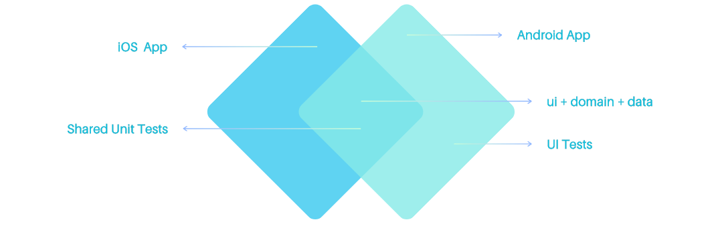
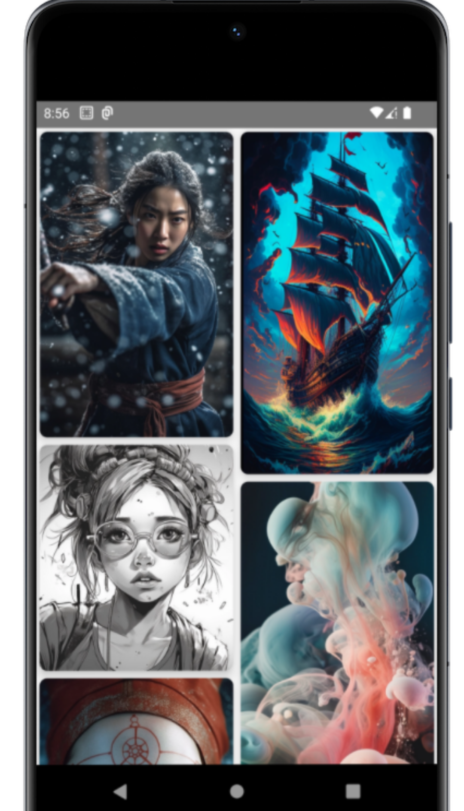
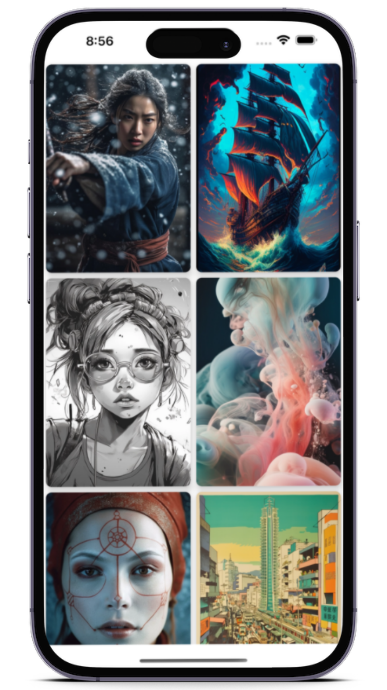
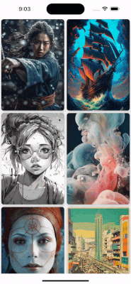
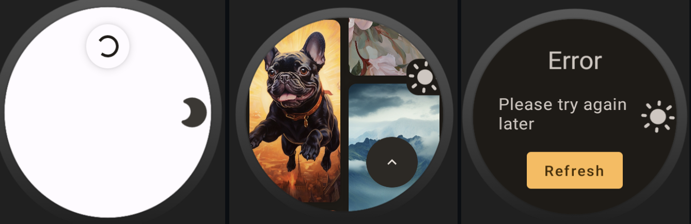

# MidJourney Images Compose Multiplatform Mobile Application
[](https://androidweekly.net/issues/issue-567)
<a href="https://mailchi.mp/kotlinweekly/kotlin-weekly-352"></a>

Bu uygulama, çoklu platform desteği ile MidJourney'ın oluşturduğu resimleri göstermek için geliştirilmiştir. Uygulama,
Compose Multiplatform ile geliştirilmiştir. Uygulama, Android, iOS platformlarında çalışmaktadır.

<p align="center"><br><br></p>
Kotlin ve Jetpack Compose kullanılarak MVVM konseptinde geliştirtirildi. Network request state'leri, endless pagination, image loading ve image caching işlemleri yapılmıştır.

## Kullanılan Kütüphaneler

- [Compose Multiplatform](https://www.jetbrains.com/lp/compose-multiplatform/)
- [Ktor](https://ktor.io/)
- [Koin](https://insert-koin.io/)
- [Kotlinx Serialization](https://kotlinlang.org/docs/serialization.html)
- [Kotlinx Coroutines](https://kotlinlang.org/docs/coroutines-overview.html)
- [Compose ImageLoader](https://github.com/qdsfdhvh/compose-imageloader)
- [KMM-ViewModel](https://github.com/rickclephas/KMM-ViewModel)
- [Compose Material Dialogs](https://github.com/vanpra/compose-material-dialogs)
- [Multiplatform Settings](https://github.com/russhwolf/multiplatform-settings)

<div style="text-align: center;"></div>

Consumer App'ler herhangi bir komplex yapıya sahip değildir. Ortak ui layer'ı kullanırlar(viewModel dahil) ve
MjImagesApp'i oluşturmakla sorumludurlar. [MjImagesApp](https://github.com/mbakgun/midjourney-images-compose-multiplatform/blob/e640ac5893478fa0b0b3ed6e71f2b3b66765ce0d/shared/src/commonMain/kotlin/ui/MjImagesApp.kt#L38-L38) ve bu Composable'nin dependency'si [MjImagesViewModel](https://github.com/mbakgun/midjourney-images-compose-multiplatform/blob/e640ac5893478fa0b0b3ed6e71f2b3b66765ce0d/shared/src/commonMain/kotlin/ui/MjImagesViewModel.kt#L15-L15), Android ve
iOS platformlarında ortak çalışır.

## Gereksinimler

- MacOS
- Linkteki gibi [ortam](https://github.com/JetBrains/compose-multiplatform-ios-android-template#set-up-the-environment)
  kurulu olmalıdır.

 

## Android Application

Android uygulamasını derlemek için aşağıdaki komutu çalıştırın:

```bash
./gradlew :androidApp:assembleDebug
```

<br>

## iOS Application

Proje build edildikten sonra iOS uygulaması herhangi bir emulator veya cihaz üzerinde çalıştırılabilir. Android Studio
veya Xcode kullanılabilir.

<br>

## Wear OS Application

Proje build edildikten sonra Wear OS uygulaması herhangi bir emulator veya cihaz üzerinde çalıştırılabilir. 

<br>

## Android TV Application

Proje build edildikten sonra Android TV uygulaması herhangi bir emulator veya cihaz üzerinde çalıştırılabilir.

<br><video src="image-assets/television.mov"/>

## Android Automotive Application

Proje build edildikten sonra Android Automotive uygulaması herhangi bir emulator(Android Studio Hedgehog gerektirir) veya cihaz üzerinde çalıştırılabilir.

<br><video src="image-assets/automotive.mov"/>

## Test

Uygulama ui test ve unit testlere sahiptir. Unit testler common paket altında, fake data ile yazılmıştır. UI testler ise
androidTest paketi altında yazılmıştır.

* Unit Testleri çalıştırmak için aşağıdaki komutu çalıştırın:

    ```bash
    ./gradlew :shared:cleanTestDebugUnitTest :shared:testDebugUnitTest
    ```

## API

Uygulama için kullanılan API, [mj.akgns.com](https://mj.akgns.com/) şeklindedir.

## Gelecek Planlar

- [] K2 Compiler
- [] Compose Multiplatform 1.5.0

## Çeviri
- [İngilizce](/README.md) 
- [Almanca](/README-de.md)

## Medium

Daha fazla bilgi için [Medium](https://mbakgun.medium.com/mj-compose-multiplatform-e6f737b3cd18) yazısına göz atabilirsiniz.

## Katkı 👏

Lütfen issue açmakta özgür hissedin; her türlü katkı memnuniyetle karşılanacaktır! Şimdiden elinize
sağlık ✌️

## İletişim

* Linkedin: https://www.linkedin.com/in/mbakgun
* Twitter: https://twitter.com/mbakguns
* Mastodon: https://androiddev.social/@mbakgun

License
-----------------

      MIT License

      Copyright (c) 2023 Mehmet Burak Akgün 
      
      Permission is hereby granted, free of charge, to any person obtaining a copy
      of this software and associated documentation files (the "Software"), to deal
      in the Software without restriction, including without limitation the rights
      to use, copy, modify, merge, publish, distribute, sublicense, and/or sell
      copies of the Software, and to permit persons to whom the Software is
      furnished to do so, subject to the following conditions:
      
      The above copyright notice and this permission notice shall be included in
      all copies or substantial portions of the Software.
      
      THE SOFTWARE IS PROVIDED "AS IS", WITHOUT WARRANTY OF ANY KIND, EXPRESS OR
      IMPLIED, INCLUDING BUT NOT LIMITED TO THE WARRANTIES OF MERCHANTABILITY,
      FITNESS FOR A PARTICULAR PURPOSE AND NONINFRINGEMENT. IN NO EVENT SHALL THE
      AUTHORS OR COPYRIGHT HOLDERS BE LIABLE FOR ANY CLAIM, DAMAGES OR OTHER
      LIABILITY, WHETHER IN AN ACTION OF CONTRACT, TORT OR OTHERWISE, ARISING FROM,
      OUT OF OR IN CONNECTION WITH THE SOFTWARE OR THE USE OR OTHER DEALINGS IN
      THE SOFTWARE.