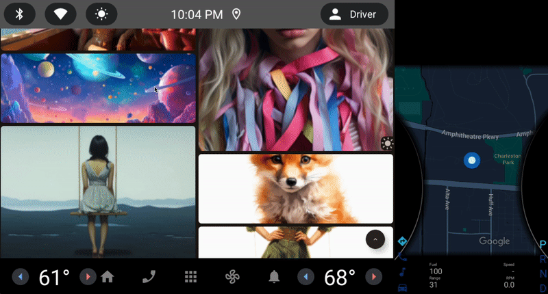

# MidJourney Images Compose Multiplatform Mobile Application
[](https://androidweekly.net/issues/issue-567)
<a href="https://mailchi.mp/kotlinweekly/kotlin-weekly-352"></a>
[](https://github.com/mbakgun/midjourney-images-compose-multiplatform/actions/workflows/main.yml)
#### Featured in [Google dev library](https://devlibrary.withgoogle.com/products/android/repos/mbakgun-midjourney-images-compose-multiplatform)

This application is developed to display the images created by MidJourney. The application is developed with Compose Multiplatform and works on Android, iOS, Web, Wear OS, Android Automotive, Android TV platforms.

<p align="center"><br><br></p>
Application developed in the MVVM concept using Kotlin and Jetpack Compose. Network request states, endless pagination, image loading, and image caching processes were performed.

## Libraries Used

- [Compose Multiplatform](https://www.jetbrains.com/lp/compose-multiplatform/)
- [Ktor](https://ktor.io/)
- [Koin](https://insert-koin.io/)
- [Kotlinx Serialization](https://kotlinlang.org/docs/serialization.html)
- [Kotlinx Coroutines](https://kotlinlang.org/docs/coroutines-overview.html)
- [Coil](https://coil-kt.github.io/coil/)
- [KMM-ViewModel](https://github.com/rickclephas/KMM-ViewModel)
- [Multiplatform Settings](https://github.com/russhwolf/multiplatform-settings)

<div style="text-align: center;"></div>

Consumer apps do not have any complex structures or operations. They use the common UI layer (including ViewModel) and are responsible for creating [MjImagesApp](https://github.com/mbakgun/midjourney-images-compose-multiplatform/blob/e640ac5893478fa0b0b3ed6e71f2b3b66765ce0d/shared/src/commonMain/kotlin/ui/MjImagesApp.kt#L38-L38). MjImagesApp and the dependency of this Composable, [MjImagesViewModel](https://github.com/mbakgun/midjourney-images-compose-multiplatform/blob/e640ac5893478fa0b0b3ed6e71f2b3b66765ce0d/shared/src/commonMain/kotlin/ui/MjImagesViewModel.kt#L15-L15), works as same on all platforms.

## Requirements

- MacOS
- [Environment](https://github.com/JetBrains/compose-multiplatform-ios-android-template#set-up-the-environment) must be installed as described in the link.

 


## Android Application

Run the following command to compile the Android application:

```bash
./gradlew :androidApp:assembleDebug
```

<br>

## iOS Application

After the project is built, the iOS application can be run on any emulator or device. Android Studio or Xcode can be used.

<br>

## Wear OS Application

After the project is built, the Wear OS application can be run on any emulator or device.

```bash
./gradlew :wearApp:assembleDebug
```


## Android TV Application

After the project is built, the Android TV application can be run on any emulator or device.

```bash
./gradlew :televisionApp:assembleDebug
```


## Android Automotive Application

After the project is built, the Android Automotive application can be run on any emulator (requires Android Studio Hedgehog) or device.

```bash
./gradlew :automotiveApp:assembleDebug
```



## Desktop Application

This project can be built for Windows, Debian, and MacOS.

```bash
./gradlew desktopApp:run
```

### Building native desktop distribution

```
./gradlew :desktop:packageDistributionForCurrentOS
# outputs are written to desktopApp/build/compose/binaries
```


## Web Application

This project can be built for the Compose for Web(JS).
[Demo](https://mj.akgns.com/compose)

```
./gradlew :webApp:jsBrowserDevelopmentRun
```

### Building web distribution

```
./gradlew :webApp:jsBrowserDevelopmentExecutableDistribution
./gradlew :webApp:jsBrowserDistribution
```

## Wasm Application
This project can be built for the Compose for Web(Wasm).
[Demo](https://mj.akgns.com/wasm)

```
./gradlew :wasmApp:wasmBrowserDevelopmentRun
```

### Building wasm distribution

```
./gradlew :wasmApp:wasmBrowserDevelopmentExecutableDistribution
./gradlew :wasmApp:wasmJsBrowserDistribution
```


## Testing

The application has Compose UI tests, Maestro UI tests, and unit tests. The unit tests are written under the common package with fake data. The UI tests are written under the androidTest package. The Maestro tests are written under the [maestro package](https://github.com/mbakgun/midjourney-images-compose-multiplatform/tree/master/.maestro).

* To run the unit tests, run the following command:

    ```bash
    ./gradlew :shared:cleanTestDebugUnitTest :shared:testDebugUnitTest
    ```
* To run the Maestro Tests, execute the following command:

   ```bash
    maestro test .maestro
    ```
* To run the Android Instrumented UI tests, run the following command:

    ```bash
    ./gradlew :shared:connectedAndroidTest
    ```

## API

The API used for the application is [mj.akgns.com](https://mj.akgns.com/).

## Translations
- [Türkçe](/README-tr.md)
- [German](/README-de.md)

## Medium

For more information, check out the [Medium](https://mbakgun.medium.com/mj-compose-multiplatform-e6f737b3cd18) post.

## Contributions 👏

Please feel free to open an issue; any contributions will be appreciated! Thank you in advance.

## Contact

* Linkedin: https://www.linkedin.com/in/mbakgun
* Twitter: https://twitter.com/mbakguns
* Mastodon: https://androiddev.social/@mbakgun

License
-----------------

      MIT License

      Copyright (c) 2023 Mehmet Burak Akgün 
      
      Permission is hereby granted, free of charge, to any person obtaining a copy
      of this software and associated documentation files (the "Software"), to deal
      in the Software without restriction, including without limitation the rights
      to use, copy, modify, merge, publish, distribute, sublicense, and/or sell
      copies of the Software, and to permit persons to whom the Software is
      furnished to do so, subject to the following conditions:
      
      The above copyright notice and this permission notice shall be included in
      all copies or substantial portions of the Software.
      
      THE SOFTWARE IS PROVIDED "AS IS", WITHOUT WARRANTY OF ANY KIND, EXPRESS OR
      IMPLIED, INCLUDING BUT NOT LIMITED TO THE WARRANTIES OF MERCHANTABILITY,
      FITNESS FOR A PARTICULAR PURPOSE AND NONINFRINGEMENT. IN NO EVENT SHALL THE
      AUTHORS OR COPYRIGHT HOLDERS BE LIABLE FOR ANY CLAIM, DAMAGES OR OTHER
      LIABILITY, WHETHER IN AN ACTION OF CONTRACT, TORT OR OTHERWISE, ARISING FROM,
      OUT OF OR IN CONNECTION WITH THE SOFTWARE OR THE USE OR OTHER DEALINGS IN
      THE SOFTWARE.